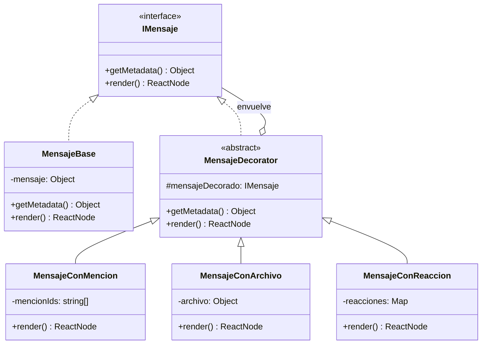
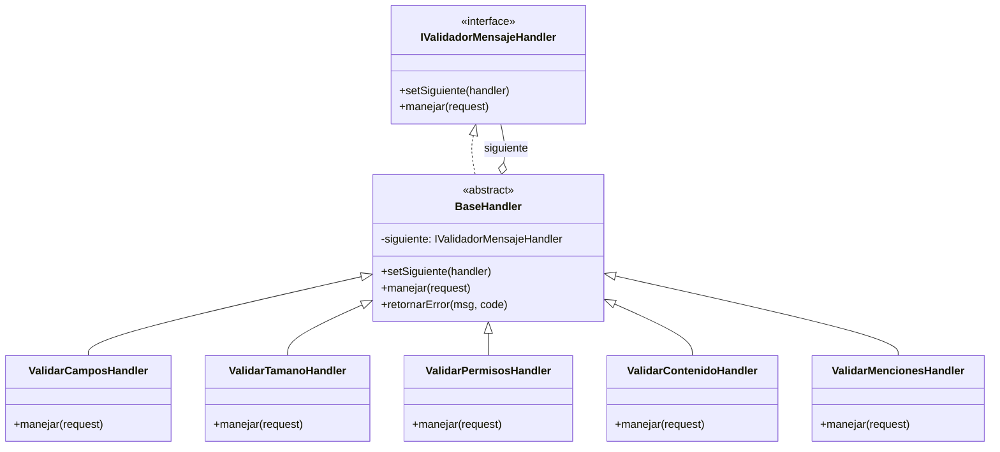
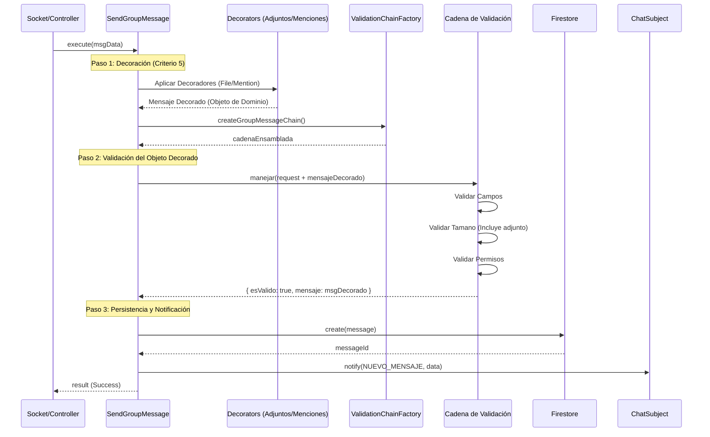
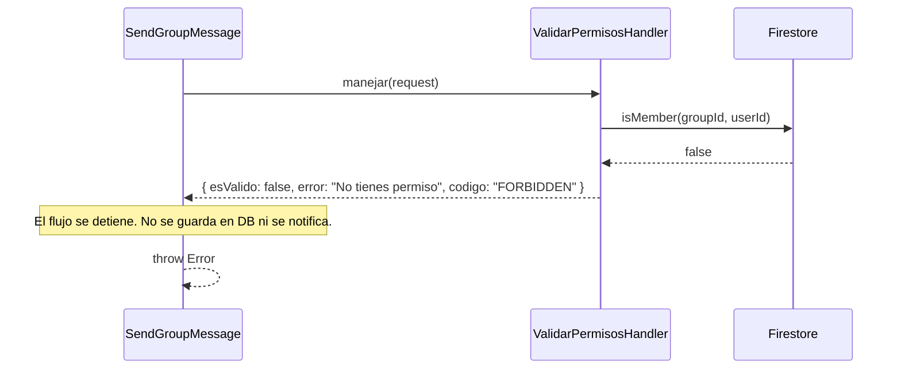

# Chat Service - Arquitectura de Mensajería (Patrón Decorator)

Este módulo implementa el **Patrón Decorator** para la gestión y renderizado de mensajes. Esta elección arquitectónica permite extender las funcionalidades de un mensaje (menciones, archivos adjuntos, reacciones) de manera dinámica y componible sin necesidad de modificar la clase base de mensajes.

## 1. Descripción del Patrón

El patrón Decorator se utiliza para añadir responsabilidades a objetos de forma dinámica. En nuestro sistema de chat, un mensaje puede ser simplemente texto, pero también puede tener metadatos adicionales que requieren un comportamiento o renderizado especial.

### Componentes Clave:
- **IMensaje (Interfaz/Abstracta)**: Define la estructura básica que todo mensaje debe seguir (getMetadata, render).
- **MensajeBase (Componente Concreto)**: La implementación básica que contiene el texto del mensaje.
- **MensajeDecorator (Decorador Base)**: Mantiene una referencia a un objeto `IMensaje` y delega las operaciones a él.
- **Decoradores Concretos**: 
    - `MensajeConMencion`: Resalta usuarios mencionados en el texto.
    - `MensajeConArchivo`: Añade la lógica de visualización y descarga de adjuntos.
    - `MensajeConReaccion`: Gestiona el mapa de emojis y contadores.

## 2. Diagrama de Clases (UML)



## 3. Componibilidad y MensajeFactory

La potencia de esta arquitectura reside en que los decoradores son **componibles**. Un mensaje puede ser envuelto múltiples veces para combinar funcionalidades. 

La `MensajeFactory` es la encargada de orquestar este orden de envoltura:

```typescript
// Ejemplo de composición en MensajeFactory
let mensaje = new MensajeBase(rawMessage);

if (rawMessage.hasMention) {
    mensaje = new MensajeConMencion(mensaje, rawMessage.mentions);
}

if (rawMessage.fileUrl) {
    mensaje = new MensajeConArchivo(mensaje, rawMessage.fileMetadata);
}

if (rawMessage.reacciones) {
    mensaje = new MensajeConReaccion(mensaje, rawMessage.reacciones);
}

// Al llamar a mensaje.render(), se ejecuta la cadena:
// Reaccion(Archivo(Mencion(Base)))
```

### Ventajas de esta implementación:
1. **Principio de Responsabilidad Única**: Cada decorador solo sabe gestionar su funcionalidad específica.
2. **Principio de Abierto/Cerrado**: Podemos añadir un nuevo tipo de mensaje (ej. `MensajeConEncuesta`) creando un nuevo decorador sin tocar el código existente.
3. **Orden de Renderizado**: Permite controlar exactamente si un elemento se dibuja "dentro" o "fuera" del contenido base.

## 4. Validación de Mensajes (Patrón Chain of Responsibility) - US-CH01

Para el envío de mensajes, hemos implementado el patrón **Chain of Responsibility (CoR)**. Esta arquitectura permite centralizar y modularizar las validaciones, asegurando que el sistema sea extensible y eficiente.

### Componentes de la Cadena:
1.  **ValidarCamposHandler**: Verifica que el mensaje no esté vacío.
2.  **ValidarTamanoHandler**: Controla el límite de caracteres (Criterio 2).
3.  **ValidarPermisosHandler**: Valida la membresía del usuario en el grupo.
4.  **ValidarContenidoHandler**: Filtra lenguaje ofensivo o spam.
5.  **ValidarMencionesHandler**: Detecta menciones e inyecta los IDs detectados para optimizar el flujo posterior.

### Diagrama de Clases (UML)



### Diagrama de Secuencia: Flujo de Envío Exitoso



### Diagrama de Secuencia: Flujo de Cortocircuito (Fallo de Permisos)



### Beneficios Técnicos:
*   **Limpieza de Código**: Se eliminaron bloques `if/else` anidados en los casos de uso.
*   **Integridad de Datos (Criterio 5)**: Se garantiza que la cadena de responsabilidad valide el objeto de dominio ya enriquecido por los decoradores. Esto permite que el ValidarTamanoHandler considere metadatos de archivos adjuntos, asegurando que ninguna regla de negocio sea burlada tras la decoración.
*   **Extensibilidad**: Para añadir una nueva validación (ej. `ValidarAntiSpamAvanzado`), solo se requiere crear el handler y añadirlo a la `ValidationChainFactory` sin tocar la lógica de negocio del chat.
*   **Handler de Éxito**: El sistema no solo retorna un booleano; la cadena devuelve el objeto de mensaje validado y procesado, asegurando que el orquestador trabaje siempre con la versión final y segura del dato.

---
*Documentación actualizada para la US-CH01 - Sprint 4.*
