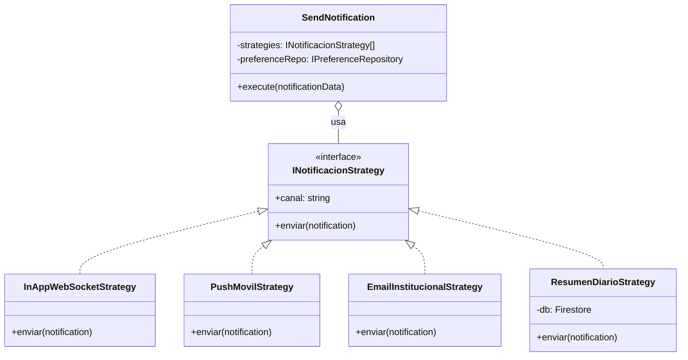

# Microservicio de Notificaciones - UniConnect

Este microservicio se encarga de gestionar y despachar notificaciones a través de múltiples canales (In-App, Push, Email).

## Arquitectura: Patrón Strategy

Se ha implementado el **Patrón Strategy** para desacoplar la lógica de "qué se notifica" de la lógica de "cómo se envía". Esto permite que el sistema sea altamente extensible y cumpla con el principio **Open/Closed**.

### ¿Por qué Strategy?
1. **Extensibilidad:** Se pueden añadir nuevos canales (WhatsApp, SMS) sin modificar el caso de uso central.
2. **Resiliencia:** El fallo de un canal (ej. caída de un servidor SMTP) no impide que la notificación llegue por otros canales.
3. **Personalización:** Permite filtrar canales dinámicamente según las preferencias del usuario.

### Diagrama de Clases (Mermaid)



### El Flujo de Resumen Diario (Cron Job)
La **ResumenDiarioStrategy** funciona junto con un proceso programado (`dailySummaryJob.js`). En lugar de enviar la notificación de inmediato, la guarda en un buffer de Firestore (`daily_buffer`). A las 8:00 PM, el Cron Job consolida todas las notificaciones pendientes de un usuario, las envía en un solo mensaje, y realiza una limpieza atómica del buffer.

## Guía de Extensibilidad: Añadir un nuevo canal

Para añadir un nuevo canal (ej. `WhatsAppStrategy`), siga estos pasos sin modificar el núcleo del servicio:

1. **Crear la Estrategia:** Cree un archivo en `src/infrastructure/strategies/WhatsAppStrategy.js` que herede de `INotificacionStrategy`.
   ```javascript
   class WhatsAppStrategy extends INotificacionStrategy {
     constructor() {
       super();
       this.canal = 'whatsapp';
     }
     async enviar(notification) {
       // Lógica de integración con API de WhatsApp
       return { canal: 'whatsapp', enviado: true };
     }
   }
   ```
2. **Inyectar la Estrategia:** En `index.js`, instancie la nueva clase y añádala al array de estrategias inyectadas en `SendNotification`.
   ```javascript
   const strategies = [
     new InAppWebSocketStrategy(...),
     new ResumenDiarioStrategy(...),
     new WhatsAppStrategy(), // ¡Listo!
   ];
   ```

## Gestión de Resiliencia
Cada estrategia se ejecuta dentro de un bloque `try/catch` aislado. Si un proveedor externo falla, el error se captura y se registra, pero el proceso continúa para los demás canales habilitados.
