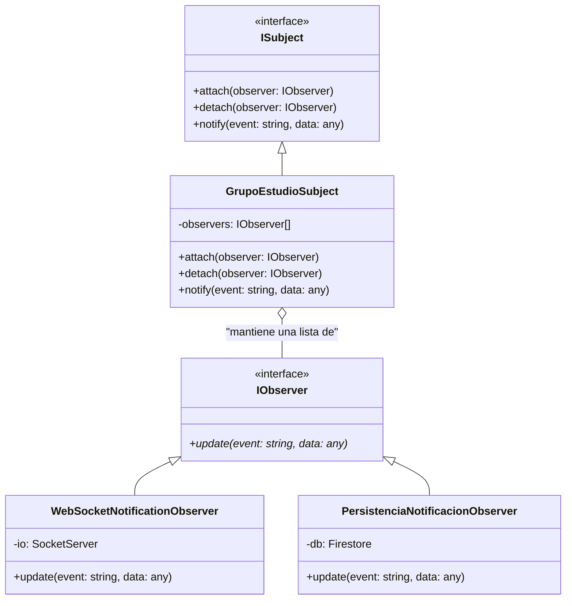

# Social Service - UniConnect

Este microservicio gestiona la lógica de grupos de estudio y eventos para la plataforma UniConnect de la Universidad de Caldas.

## Patrón de Diseño: Observer

Para cumplir con los criterios de desacoplamiento y notificaciones en tiempo real, se ha implementado el patrón **Observer**. Este patrón permite que los cambios de estado en un grupo de estudio (asunto) se notifiquen automáticamente a múltiples interesados (observadores).

### Estructura UML (Mermaid)

### Eventos Definidos
Los eventos se encuentran tipados y centralizados para asegurar la consistencia en todo el sistema:
- `SOLICITUD_INGRESO`: Disparado cuando un estudiante solicita unirse.
- `MIEMBRO_ACEPTADO`: Disparado cuando el admin aprueba a un nuevo miembro.
- `MIEMBRO_RECHAZADO`: Disparado cuando el admin declina una solicitud.
- `TRANSFERENCIA_ADMIN`: Disparado cuando se cambia el propietario del grupo.

### Flujo de Trabajo
1. Los **Observers** se registran en el `GrupoEstudioSubject` al iniciar el microservicio (`index.js`).
2. Cuando un **Caso de Uso** (ej: `SendJoinRequest`) detecta un cambio de estado, llama a `subject.notify()`.
3. El **Subject** itera sobre sus observadores y ejecuta el método `update()`.
4. Cada observador realiza su tarea específica (enviar un socket o guardar en la base de datos) de forma independiente.
