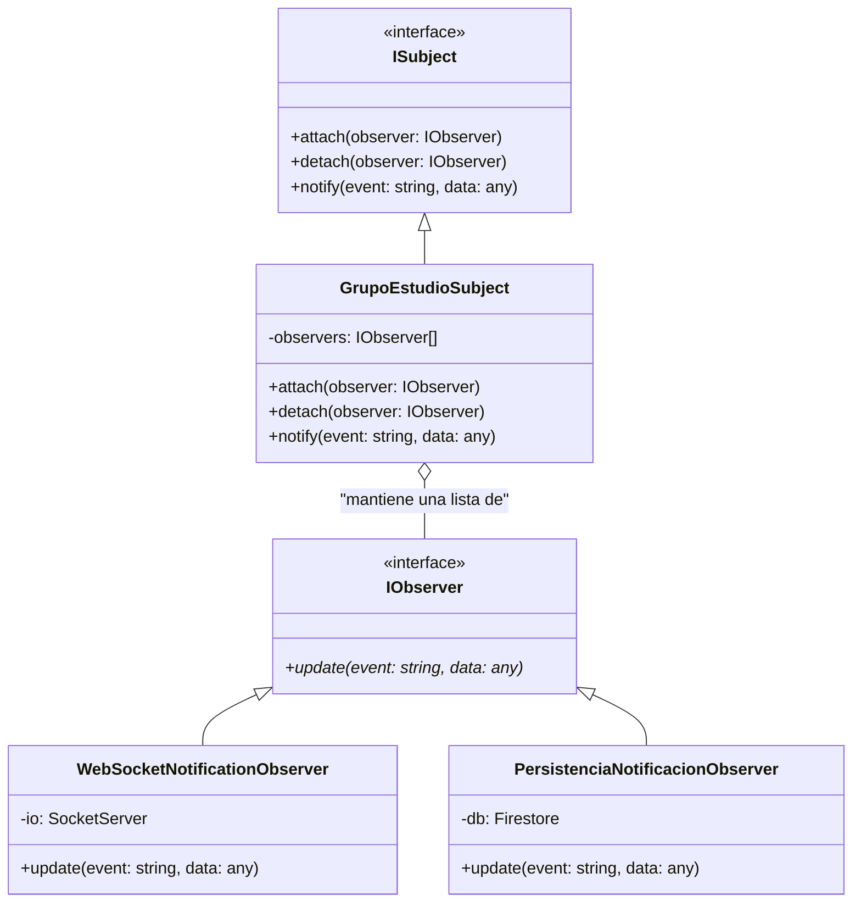
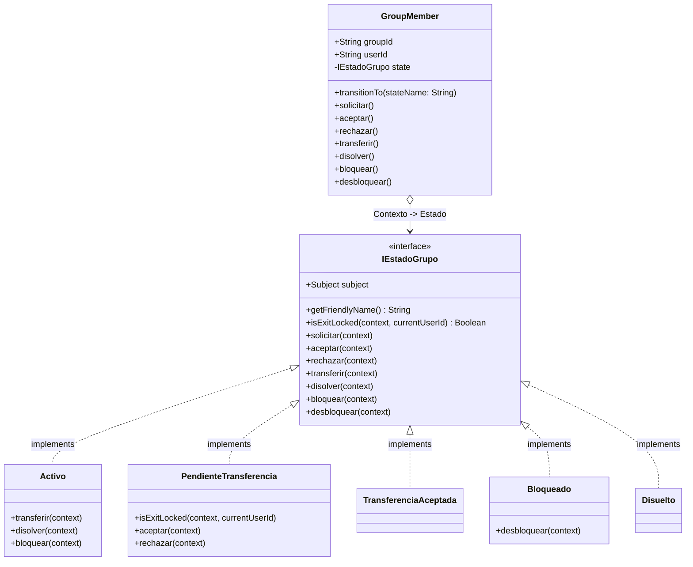
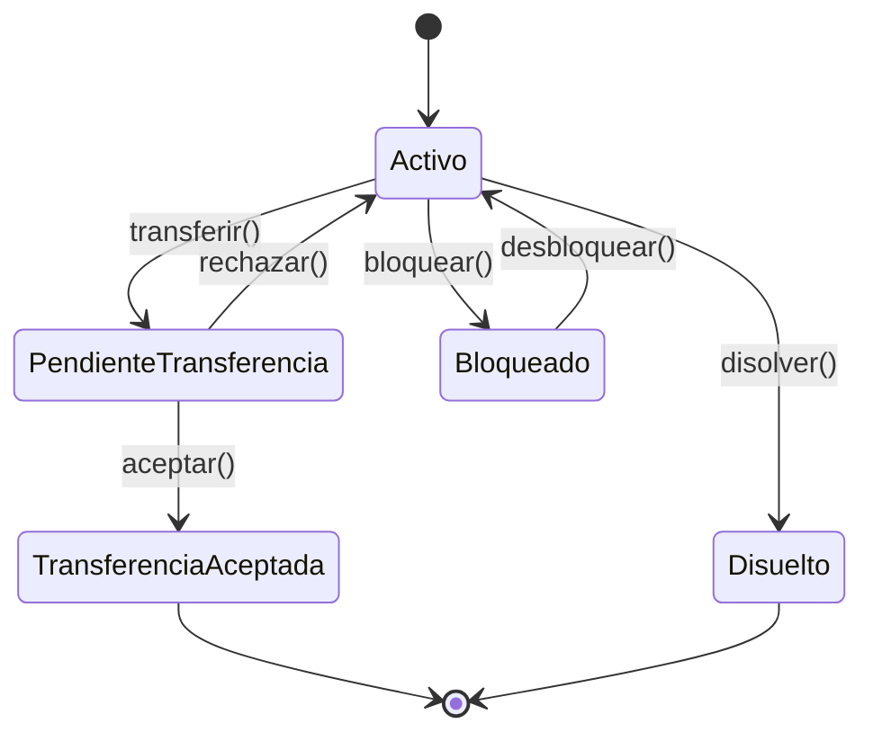

# Social Service - UniConnect

Este microservicio gestiona la lógica de grupos de estudio y eventos para la plataforma UniConnect de la Universidad de Caldas.

## Patrón de Diseño: Observer

Para cumplir con los criterios de desacoplamiento y notificaciones en tiempo real, se ha implementado el patrón **Observer**. Este patrón permite que los cambios de estado en un grupo de estudio (asunto) se notifiquen automáticamente a múltiples interesados (observadores).

### Estructura UML (Mermaid)

### Eventos Definidos
Los eventos se encuentran tipados y centralizados para asegurar la consistencia en todo el sistema:
- `SOLICITUD_INGRESO`: Disparado cuando un estudiante solicita unirse.
- `MIEMBRO_ACEPTADO`: Disparado cuando el admin aprueba a un nuevo miembro.
- `MIEMBRO_RECHAZADO`: Disparado cuando el admin declina una solicitud.
- `TRANSFERENCIA_ADMIN`: Disparado cuando se cambia el propietario del grupo.

### Flujo de Trabajo
1. Los **Observers** se registran en el `GrupoEstudioSubject` al iniciar el microservicio (`index.js`).
2. Cuando un **Caso de Uso** (ej: `SendJoinRequest`) detecta un cambio de estado, llama a `subject.notify()`.
4. Cada observador realiza su tarea específica (enviar un socket o guardar en la base de datos) de forma independiente.

## Patrón de Diseño: State (US-ST01)

Para cumplir con los criterios de la US-ST01 y eliminar los condicionales anidados relacionados con el ciclo de vida de un grupo, se ha implementado el patrón **State**.

### Diagrama de Clases (UML)
Representa el desacoplamiento estructural entre el Contexto (`GroupMember`) y sus estados a través de la interfaz abstracta `IEstadoGrupo`.

### Diagrama de Estados (Máquina de Estados)
Muestra el ciclo de vida de un grupo y cómo los métodos disparan las transiciones orquestadas.

### Justificación Técnica: Eliminación de Condicionales Anidados
El Patrón State implementado resuelve de tajo el anti-patrón de los múltiples condicionales anidados (`if / else if / switch`). 

Con esta arquitectura, **el Contexto (`GroupMember`) es ciego**. Simplemente delega el intento de acción a la clase de estado que tiene en memoria (`return this.state.transferir(this)`). 

- Si la acción es inválida (ej. intentar transferir un grupo `Disuelto`), el llamado recae en la interfaz base `IEstadoGrupo` la cual arroja un error estándar de forma implícita.
- Si la acción es válida, la clase concreta (`Activo`) intercepta el llamado y ejecuta su regla de negocio.
- Esto cumple con el **Principio Abierto/Cerrado (OCP)** de SOLID: añadir nuevos estados en el futuro solo implica crear nuevas clases, sin modificar condicionales existentes en el contexto.
